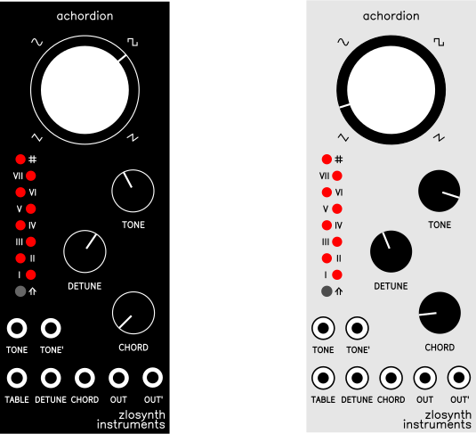

# Achordion

Chord-crafting quantizing wavetable oscillator module for Eurorack.

   

* Wavetable synthesis, 37 wavetables, smooth transitions
* Up to 18 simultaneous voices
* Sub-octaves, duplicated tones, and chords
* 4 styles of playing - single tone, chords, arpeggios, intervals
* Quantization to selected scale
* Any scale can be played with the white piano keys
* Two lines with independent 1V/oct inputs and audio outputs
* LEDs visualizing dialed parameters
* Based around Electro-Smith's [Daisy Patch SM](https://www.electro-smith.com/daisy/patch-sm) platform
* Programmed in Rust

Find more details about the module, including a feature overview video and a
user manual, on its [website](https://zlosynth.com/achordion).

# Development

See [DEVELOPMENT.md](DEVELOPMENT.md) to find some basic commands to interact
with the project. To learn more, read the code. A good place to start would be
[eurorack/src/main.rs](eurorack/src/main.rs).

# License

Software of Achordion is distributed under the terms of the General Public
License version 3. See [LICENSE-SOFTWARE](LICENSE-SOFTWARE) for details.

Schematics and PCB layout are distributed under the terms of Creative Commons
BY-SA. See [LICENSE-HARDWARE](LICENSE-HARDWARE) for details. Parts of the
schematics are based on [Emilie Gillet's Mutable
Instruments](https://github.com/pichenettes/eurorack), kudos to her for making
them open.

The manual is distributed under the terms of Creative Commons BY-SA too. See
[LICENSE-MANUAL](LICENSE-MANUAL) for details.

# Changelog

Read the [CHANGELOG.md](CHANGELOG.md) to learn about changes introduced in each
release.

# Versioning

See [VERSIONING.md](VERSIONING.md) to find detailed information about versioning
of the project and compatability between its software and hardware.
